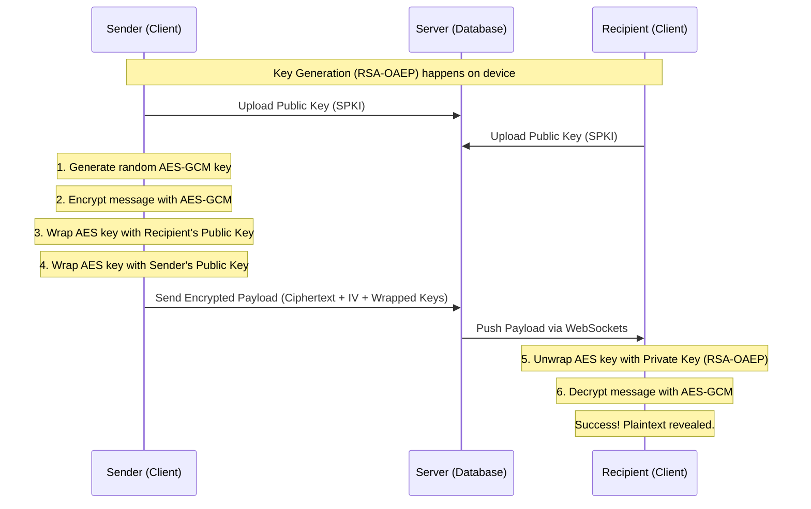

# WhisperBox — End-to-End Encrypted Messaging

WhisperBox is a secure, privacy-focused messaging application built for the HNG Stage 4B task. It implements strict **End-to-End Encryption (E2EE)** using the Web Crypto API, ensuring that only the sender and the recipient can read the contents of a message.

## Architecture Diagram

## Encryption Flow

WhisperBox uses a **Hybrid Encryption** model:

1.  **Symmetric Encryption (AES-GCM 256-bit)**: Used for the actual message content because it is fast and efficient. A unique Initialization Vector (IV) is generated for every single message to prevent pattern analysis.
2.  **Asymmetric Encryption (RSA-OAEP 2048-bit)**: Used to securely exchange the AES "Session Key."
3.  **The "Double Wrap"**: When a message is sent, the AES session key is encrypted twice:
    *   Once with the **Recipient's Public Key** (so they can read it).
    *   Once with the **Sender's Public Key** (so the sender can view their own chat history).

## Key Management

### Identity Keys
*   **Public Key**: Exported as `spki` format and stored on the server. Used by others to encrypt messages for you.
*   **Private Key**: Generated on the client and stored securely in **IndexedDB**. It never leaves the client's device in an unencrypted state.

### Key Recovery & Persistence
*   To allow cross-device support, the Private Key is "wrapped" (encrypted) using a key derived from the user's password via **PBKDF2**. This wrapped key is stored on the server.
*   The server can store it, but cannot use it, because it does not know the user's password.

## Security Trade-offs & Limitations

### Trade-offs
*   **Performance vs. Security**: We chose 2048-bit RSA for wide compatibility and performance. While 4096-bit is stronger, it significantly increases the time required for key generation on mobile devices.
*   **Storage**: Storing two wrapped keys per message increases the database size by ~1KB per message, but this is necessary for a seamless user experience (reading sent history).

### Known Limitations
*   **No Forward Secrecy**: Currently, if a user's long-term private key is compromised, all past messages could potentially be decrypted. (Future improvement: Implement Signal-style Double Ratchet).
*   **Metadata Visibility**: While the content is hidden, the server still knows *who* is talking to *whom* and *when*.

## Technical Stack
*   **Frontend**: Next.js 16, Tailwind CSS, TypeScript
*   **Security**: Web Crypto API, IndexedDB
*   **Communication**: REST API + WebSockets
